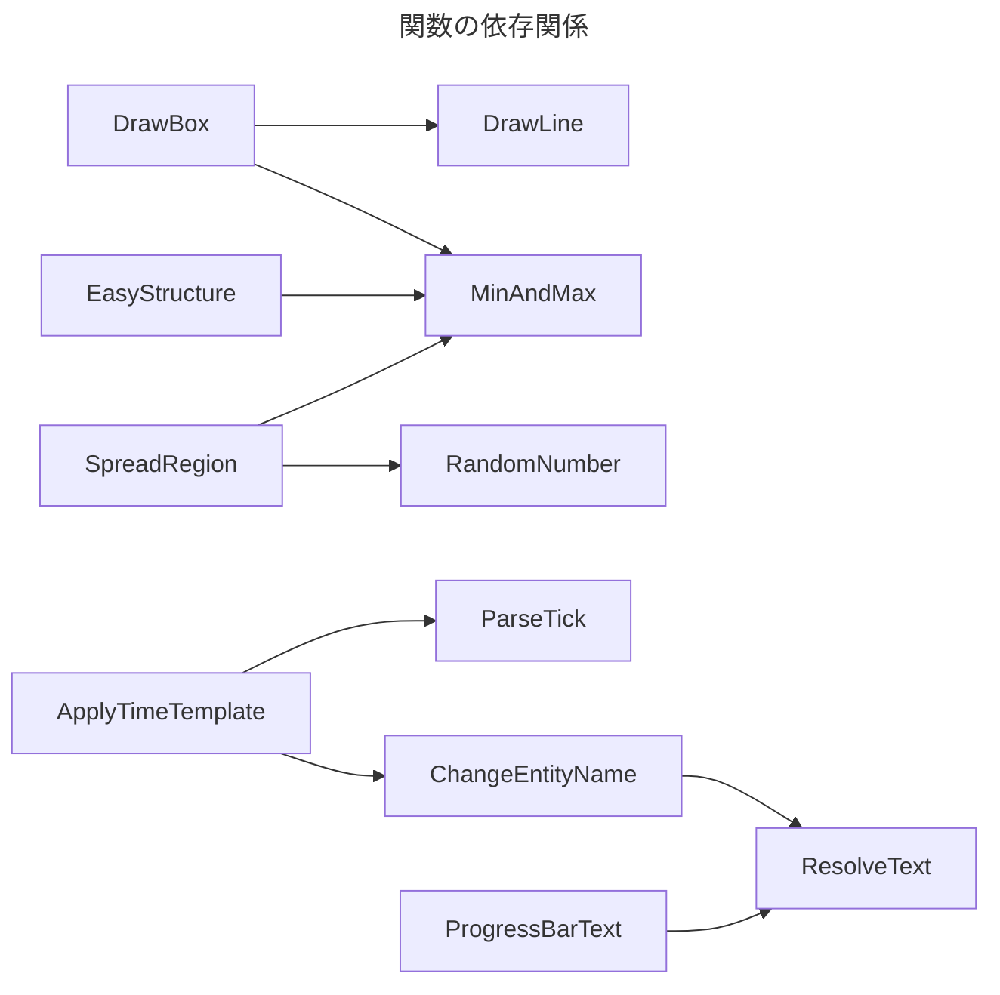

# KZE Map Simplification

KZEのマップで使えそうな関数群を纏めたデータパック  

~~コマンド多めのマップじゃないと使わないほうが多い~~

## 注意

多くの関数は初期化しないと**正常に動作しません**  
ステージの開始時などに`kms:init`を実行して初期化してください

## 目次

- [KZE Map Simplification](#kze-map-simplification)
  - [注意](#注意)
  - [目次](#目次)
  - [凡例](#凡例)
    - [関数名](#関数名)
  - [エンティティ系](#エンティティ系)
    - [ApplyTimeTemplate](#applytimetemplate)
    - [DrawLine](#drawline)
    - [DrawBox](#drawbox)
    - [Launch](#launch)
    - [DrawCircle](#drawcircle)
    - [DrawFreeAxisCircle](#drawfreeaxiscircle)
    - [SpreadRegion](#spreadregion)
  - [計算 / スコア系](#計算--スコア系)
    - [AngleLerp](#anglelerp)
    - [RandomNumber](#randomnumber)
    - [MinAndMax](#minandmax)
    - [ParseTick](#parsetick)
  - [その他](#その他)
    - [ResolveText](#resolvetext)
    - [ProgressBarText](#progressbartext)
    - [NoItemMerge](#noitemmerge)
    - [EasyStructure](#easystructure)
    - [Init](#init)



## 凡例

### 関数名

関数についての説明

既定値

```json
関数用のストレージ名

{
  値の名前: 既定値,
  オブジェクトの名前: {
    オブジェクトの値1: オブジェクトの既定値1,
    オブジェクトの値2: オブジェクトの既定値2,
    オブジェクトの値3: オブジェクトの既定値3
  },
  リストの名前: [
    リストの既定値1,
    リストの既定値2,
    リストの既定値3
  ]
}
```

関数

- 関数の名前

## エンティティ系

エンティティを召喚したり位置や回転を操作する関数群

### ApplyTimeTemplate

実行者のエンティティの名前を特定の形式で`ParseTick`の結果を表示するものに変更する

既定値

```json
kms:apply_time_template

{
  UseCustomTemplate: false,
  CustomTemplate: '["Custom Template"]'
}
```

関数

- kms:apply_time_template

### DrawLine

指定した2つの座標間に指定した間隔でマーカーを配置する

既定値

```json
kms:draw_line

{
  Start: [0.0, 0.0, 0.0],
  End: [0.0, 0.0, 0.0],
  Steps: 5,
  EnableEdge: true,
  Tags: []
}
```

関数

- kms:draw/line
- kms:draw/line/self
- kms:draw/line/set_end
- kms:draw/line/set_start

### DrawBox

指定した位置とサイズ、間隔でマーカーを箱の枠状に配置する

既定値

```json
kms:draw_box

{
  Min: [0.0, 0.0, 0.0],
  Max: [0.0, 0.0, 0.0],
  Steps: [1, 1, 1],
  EnableEdge: true,
  Tags: []
}
```

関数

- kms:draw_box

### Launch

実行したエンティティを向いている方向に発射する

既定値

```json
kms:launch

{
  Speed: 1.0,
  Offset: [0.0, 0.0, 0.0],
  Replace: true
}
```

関数

- kms:launch

### DrawCircle

指定された座標を中心に、円状にマーカーを配置する

既定値

```json
kms:draw_circle

{
  Radius: 1,
  Steps: 5,
  AdaptiveStep: false,
  Yaw: 0.0f,
  Center: [0.0, 0.0, 0.0],
  Tags: []
}
```

関数

- kms:draw/circle/horizontal
- kms:draw/circle/vertical

### DrawFreeAxisCircle

実行された座標と向きを元に、指定された大きさと間隔で円状にマーカーを配置する

既定値

```json
kms:draw_free_axis_circle

{
  Radius: 1.0,
  Steps: 5,
  AdaptiveStep: false,
  Rotation: 0.0f,
  Tags: []
}
```

関数

- kms:draw/free_axis_circle

### SpreadRegion

指定した数のマーカーを指定範囲内にランダムに配置する  

なお `kms:spread_region_self` は `SpreadRegion.Count` を無視し、  
実行者のエンティティの位置を変える

既定値

```json
kms:spread_region

{
  Count: 1,
  Start: [0.0d, 0.0d, 0.0d],
  End: [0.0d, 0.0d, 0.0d],
  Tags: []
}
```

関数

- kms:spread_region
- kms:spread_region/self

## 計算 / スコア系

他の関数で使うような物たち（例外有り）

### AngleLerp

渡された角度を目標角度へ向けて線形補完する  
なおこの関数では角度を度数法として扱う

既定値

```json
kms:angle_lerp

{
  Source: 0f,
  Target: 0f,
  Delta: 0.5f,
  Result: 0f
}
```

関数

- kms:angle_lerp

### RandomNumber

0から指定した数より1小さい数の間の乱数を返す

既定値

```json
kms:random_number

{
  Max: 100,
  Result: 0
}
```

関数

- kms:random_number

### MinAndMax

渡された値をそれぞれ比較し、大きいものと小さいものに分ける

既定値

```json
kms:min_and_max

{
  A: [0.0d, 0.0d, 0.0d],
  B: [0.0d, 0.0d, 0.0d],
  Result: {
    Min: [0.0d, 0.0d, 0.0d],
    Max: [0.0d, 0.0d, 0.0d]
  }
}
```

関数

- kms:min_and_max

### ParseTick

Tickを秒や分などの他の単位に変換する

既定値

```json
kms:parse_tick

{
  Source: 0,
  DecompositionTarget: 0,
  Result: {
    MilliSeconds: 0,
    Seconds: 0,
    Minutes: 0,
    Hours: 0,
    Days: 0
  }
}
```

関数

- kms:parse_tick

## その他

### ResolveText

入力されたRaw Jsonテキストの値を確定させる

```json
kms:resolve_text

{
  Source: "",
  Result: "",
  SignPos: [0.0d, 0.0d, 0.0d]
}
```

関数

- kms:resolve_text
- kms:resolve_text/set_sign_pos

### ProgressBarText

数値をプログレスバーの形式に変換する

既定値

```json
kms:progress_bar_text

{
  InCompleteChar: '{"color":"red","text":"█"}',
  CompletedChar: '{"color":"green","text":"█"}',
  Percentage: 0,
  Length: 10,
  AutoResolve: false,
  Result: [],
  ResolvedResult: ""
}
```

関数

- kms:progress_bar_text

### NoItemMerge

アイテムエンティティが実行者の場合、自身が他のアイテムエンティティとマージしないようにする  

拾った後にインベントリ内でもスタック不可能になる為、拾えないアイテムエンティティにのみ実行することを推奨

関数

- kms:no_item_merge

### EasyStructure

ストラクチャーブロックの範囲指定を単純化する関数

関数

- kms:easy/structure_give
- kms:easy/structure

### Init

このデータパックで使用するスコアボードとストレージを初期化する

関数

- kms:init
- kms:init_scoreboard
- #kms:reset_param
